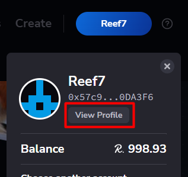
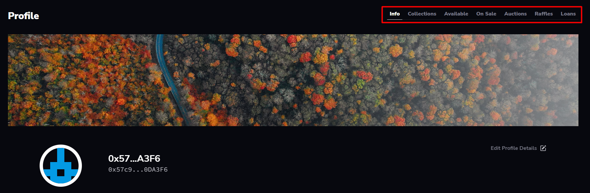

> :arrow_left: [back to menu](../README.md#sqwid-marketplace-user-guide)

# **Profile**

Profile pages are public, but only the owner of the account can edit it. To access your profile you have to [sign in](../accounts/sign_in.md#sign-in) with a Reef account, and click on the **View Profile** button.

  

Your profile page will open and you will be able to navigate through the following tabs:

-   **Info**: From here you can edit your display name and description and withdraw the balance you have available in the marketplace.
-   **Collections**: Lists all the collections you have created.
-   **Available**: Lists all your available collectibles, that is, all owned NFTs that are not currently on sale, auction, raffle, or loan.
-   **On Sale**: Lists all your collectibles on sale.
-   **Auction**: Lists all your open auctions.
-   **Raffles**: Lists all your open raffles.
-   **Loans**: Lists all your active loans and loan proposals.

  

> :arrow_left: [back to menu](../README.md#sqwid-marketplace-user-guide)
