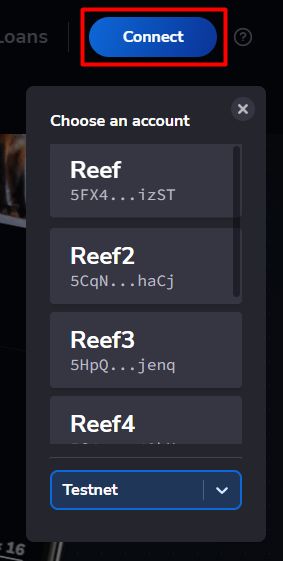
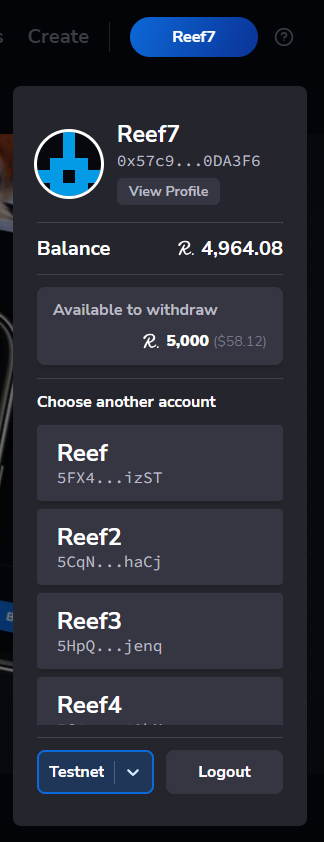

> :arrow_left: [back to menu](../README.md#sqwid-marketplace-user-guide)

# **Sign in**

To interact with Sqwid marketplace you need to do it using the desktop version, as mobile interaction is not supported yet. You will also need a compatible Reef wallet and a Reef account. We recommend to use the [official Reef extension](https://docs.reef.io/docs/users/extension/) for Chromium based and Firefox browsers.

Click on the **Connect** button. This will open the connection panel with the following options:

-   **List of accounts**: A list of all the available accounts in your wallet. You can select the account you want to use to sign in.
-   **Network selector**: You can interact with the Sqwid marketplace in the mainnet or in the testnet. The testnet can be used to practice interacting with the marketplace, as the REEF and collectibles used there do not have real value (see [here](https://docs.reef.io/docs/developers/accounts/#testnet-accounts) how to obtain testnet REEF tokens).

  

Select the account you want to sign in with. To interact with smart contracts you need to use the EVM account associated to your Reef account. If you have not claimed the EVM account yet, you will be prompted with the following message:

  

If you click on **I Accept**, your EVM account will be claimed and linked to your Reef account. This has to be done just once. Note that you need to have some available REEF in your account in order to perform this transaction. After claiming the EVM account you will be able to sign in with that account.

In the sign-in process, you will have to sign a random nonce in order to verify that you are the owner of the account.

Once you have signed in, you will find additional options in the connection panel:

-   **View Profile**: Opens your [profile page](../accounts/profile.md#profile).
-   **Balance**: Shows you the balance of your current address.
-   **Available to withdraw**: In case your REEF balance is higher to zero, this option will be shown and you will be able to withdraw the REEF into your account. Your REEF balance will increment when you bid on has ended and you have not been the highest bidder.
-   **Logout**: Closes session for the current account.

  

> :arrow_left: [back to menu](../README.md#sqwid-marketplace-user-guide)
