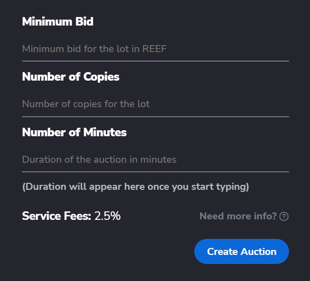
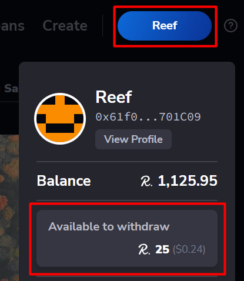

> :arrow_left: [back to menu](../README.md#sqwid-marketplace-user-guide)

# **Auction**

## **TL;DR**

An NFT owner creates an auction for a lot of one or more copies of the NFT, with a minimum bid value and a certain duration. Users can bid for the lot and, at the end of the auction, the highest bidder gets all the copies of the NFT.

<br>

## **How it works for seller**

You can put on sale any NFT you have on your **[profile's Available section](https://sqwid.app/profile?tab=Available)**, selecting an NFT and clicking on the **Create Auction** button.

<p align="center">
  
</p>

You will be prompted with a modal window that will ask you for three input data:

-   **Minimum bid**: The minimum value accepted for a bid, in REEF.
-   **Number of Copies**: Number of copies of the NFT that will be put for auction. Note that the users will bid for all the copies as a lot, and not for individual copies.
-   **Number of Minutes**: The duration of the auction, in minutes.

You can also see the value of the **service fee**. This is the amount that will be charged to you at the end of the auction if the NFT is sold.

<p align="center">
  
</p>

When you create the auction, you don't pay any fee (you just pay the gas for the transaction). The auction will start just after you create it.

Once the deadline is reached, no more bids are allowed, and any user can execute the end of the auction by clicking on the **Finalize** button of the auction's detail page.

<p align="center">
  
</p>

If the minimum bid has been filled, a service fee will be subtracted from the total amount you receive for the sale.

_E.g._

```
You create an auction for 10 copies of an NFT with a minimum bid of 50,000 REEF and a service fee of 2.5%.

The auction ends and the highest bid for the lot is 120,000 REEF.

A service fee of 3,000 REEF (120,000 REEF * 2.5%) will be charged and you receive 117,000 REEF.
```

> :warning: In the case of an NFT with royalties, they will also be subtracted from the gross amount. **[See more about royalties](./../nfts/royalties.md#royalties)**.

If the auction ends without bids, all the copies of the NFT will be again available for you.

> See also **[Auction deadline](#auction-deadline)**

<br>

## **How it works for a buyer**

You can explore all **[Auctions](https://sqwid.app/explore/auctions)**. If you open the detail page of an item, you can see the data of the NFT and will find a **Bid** button.

<p align="center">
  
</p>

Clicking on the bid button will open a modal window, where you can choose the amount you want to bid. In case the auction has no bids yet, your bid has to be equal to or higher than the minimum bid. If the auction already has bids, the amount has to be higher than the current highest bid.

<p align="center">
  
</p>

You can increase your bid any time until the deadline is reached by clicking on the **Increase Bid**.

<p align="center">
  
</p>

If you are the highest bidder, you can add to your bid any amount you want. If you are not the higher bidder, you have to add to your current bid an amount that turns you into the higher bidder.

_E.g._

```
You are the highest bidder of an item with a bid of 10,000 REEF.

Another user outbids you with a bid of 15,000 REEF.

If you want to increase your current bid, you have to do it for an amount higher than 5,000 REEF (15,000 - 10,000).

You decide to increase your original bid by 6,000 REEF and turn into the new highest bidder for a value of 16,000 REEF.
```

Once the deadline is reached, no more bids are allowed and any user can execute the end of the auction by clicking on the **Finalize** button of the auction's detail page.

<p align="center">
  
</p>

This will produce two outcomes:

-   The highest bidder will receive the NFT.
-   The rest of the bidders will increment their withdrawable balance for the total amount bid.

You can withdraw the balance you have in the contract accessing your profile's card.

<p align="center">
  
</p>

> See also **[Auction deadline](#auction-deadline)**

<br>

## **Auction deadline**

To avoid congestion in "last minute bids", if bids are made in the last 10 minutes of an auction, the deadline will be extended by 10 minutes from the time of that bid.

_E.g._

```
An auction has its deadline at 21:00 and a new bid is created at 20:56.

The deadline will be extended up to 21:06.
```

> :arrow_left: [back to menu](../README.md#sqwid-marketplace-user-guide)
