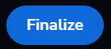

> :arrow_left: [back to menu](../README.md)

# **Raffle**

## **TL;DR**

An NFT owner creates a raffle for a lot of one or more copies of the NFT, with a certain duration. Users can participate in the raffle with the amount of Reef they want. At the end of the raffle, a winner is chosen among all the participants and gets all the copies of the NFT.

<br>

## **How it works for creator**

You can create a raffle for any NFT you have on your **[profile's Available section](https://sqwid.app/profile?tab=Available)**, selecting an NFT and clicking on the **Create Raffle** button.

<p align="center">
  
</p>

You will be prompted with a modal window that will ask you for two input data:

-   **Number of Copies**: Number of copies of the NFT for the raffle.
-   **Duration**: The duration of the raffle, in minutes.

You can also see the value of the **service fee**. This is the amount that will be charged to you at the end of the raffle if there have been participants.

<p align="center">
  
</p>

When you create the raffle you don't pay any fee (you just pay the gas for the transaction). The raffle will start just after you create it.

Once the raffle deadline is reached no more entries are allowed, and any user can execute the end of the raffle by clicking on the **Finalize** button.

<p align="center">
  
</p>

If there are participants in the raffle, a service fee will be subtracted from the total amount collected in the raffle.

_E.g._

```
You create a raffle for 10 copies of an NFT with a service fee of 2.5%.

The raffle ends with a total of 120,000 Reef collected.

A service fee of 2,400 Reef (120,000 Reef * 2.5%) will be charged and you receive 117,600 Reef.
```

> :warning: In the case of an NFT with royalties, they will also be substracted from the gross amount. **[See more about royaties](./../nfts/royalties.md#royalties)**.

If the raffle ends without any participants, all the copies of the NFT will be again available for you.

<br>

## **How it works for a participant**

You can explore all **[Raffles](https://sqwid.app/explore/raffles)**. If you open the detail page of an item, you can see the detail of the NFT and will find a **Participate** button.

<p align="center">
  
</p>

Clicking on the participate button will open a modal window, where you can the choose the amount you want to add to the raffle.

<p align="center">
  
</p>

You can participate as many times as you want and the amount will be added to your total participation value.

Once the raffle deadline is reached no more participations are allowed and any user can execute the end of the raffle by clicking on the **Finalize** button.

<p align="center">
  
</p>

This will choose a random address amoung all the participants of the raffle and send the NFT to the winner. The winner address is chosen proportionally weighted by the amount participated, that is, the more amount you participate with, the higher the chances of winning he raffle.

> :arrow_left: [back to menu](../README.md)
