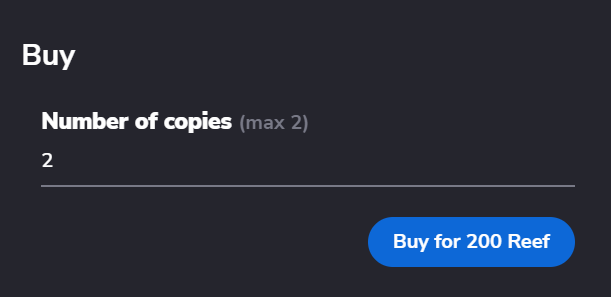

> :arrow_left: [back to menu](../README.md)

# Regular sale

## TL;DR

An NFT owner puts on sale one or more copies of the NFT for a fixed unit price. Users can buy any number of copies at the unit price.

## How it works for a seller

You can put on sale any NFT you have on your **[profile's Available section](https://sqwid.app/profile?tab=Available)**, selecting an NFT and clicking on the **Put On sale** button.

<p align="center">
  
</p>

You will be prompted with a modal window that will ask you for two input data:

-   **Price**: The price per copy in Reef.
-   **Number of Copies**: Number of copies of the NFT that you want to put on sale.

You can also see the value of the **service fee**. This is the amount that will be charged if your NFT is sold.

<p align="center">
  
</p>

When you put an NFT on sale you don't pay any fee (you just pay the gas for the transaction).

If a user buys one or more copies of your NFT, a service fee will be subtracted from the total amount you receive from the sale.

_E.g._

```
You put on sale 10 copies of an NFT at a unit price of 10,000 Reef and a service fee of 2.5%.

A user buys 4 copies of the NFT, for a total value of 40,000 Reef.

A service fee of 1,000 Reef (40,000 Reef * 2.5%) will be charged and you receive 39,000 Reef.
```

> :warning: In the case of an NFT with royalties, they will also be substracted from the gross amount. **[See more about royaties](./../nfts/royalties.md#royalties)**.

The sale remains open until all the copies have been sold or you unlist the NFT sale.

To unlist an NFT sale you can go to your **[profile's On Sale section](https://sqwid.app/profile?tab=On%20Sale)**, select the NFT, and click on the **Unlist** button.

<p align="center">
  
</p>

## How it works for a buyer

You can explore all the NFTs that are currently **[On Sale](https://sqwid.app/explore/sales)**. If you open the detail page of an item, you can see the detail of the NFT and will find a **Buy** button.

<p align="center">
  
</p>

Clicking on the buy button will open a modal window, where you can choose the number of copies to buy. The total amount to be paid will be automatically updated in the confirmation button.

<p align="center">
  
</p>

> :arrow_left: [back to menu](../README.md)
