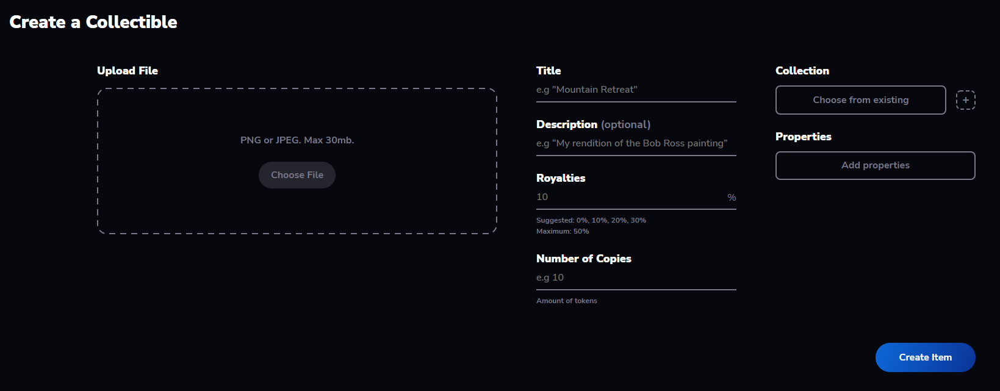

> :arrow_left: [back to menu](../README.md#sqwid-marketplace-user-guide)

# **Create User Account**

You can mint new NFTs and add them to a collection paying just for the gas fees associated with the transactions. The Sqwid marketplace does not charge any service fee.

The NFTs are created using the [SqwidERC1155 contract](https://reefscan.com/contract/0xa1957161Ee6Cb6D86Ae7A9cE12A30C40Dc9F1B68), which follows the ERC-1155 standard and extends it with additional functionalities.

To create a new collectible navigate to the **[Create page](https://sqwid.app/create)**. There you will find the following form:

  

-   **Upload file**: You can upload a file of up to 30Mb. This file will be stored in IPFS and its URI referenced in your NFT. Notice that the Sqwid NFT and marketplace contracts are fully decentralized, so any content is allowed. However, inappropriate content (like pornography or unauthorized use of intellectual property) will not be shown in the front end of the marketplace for compliance reasons.
-   **Title**: The name of your NFT.
-   **Description**: A description for your NFT. Optional field.
-   **Royalties**: Value of the royalties in percentage. Can range from 0 to 50. The default value is 0. You can read more about how royalties work [here](./royalties.md#royalties).
-   **Number of Copies**: How many copies of your NFT you want to mint. The default value is 1.
-   **Collection**: You can assign the NFT to one of your existing collections. You can also create a new collection from here. If the NFT is not assigned to any collection it will be included in the Sqwid collection.
-   **Properties**: An optional list of key-value pairs for the properties of your NFT.

 

Once your NFT is ready for creation you just have to click on the **Create Item** button and you will have to sign two transactions:

-   The first one is an approval for the SqwidMarketplace contract to mint new NFTs in the SqwidERC1155 contract. This only has to be done the first time you mint an NFT.
-   The second transaction will mint the new NFT and register it into the marketplace. Note that by registering the NFT in the marketplace you are not transferring its ownership, or any other rights over the NFT.

After the NFT has been created, you will be redirected to the collectible detail page.

In your profile, you can find all your **[collections](https://sqwid.app/profile?tab=Collections)** and **[available NFTs](https://sqwid.app/profile?tab=Available)**.

> Learn more about how to create **[sales](../market_interaction/regular_sale.md#regular-sale)**, **[auctions](../market_interaction/auction.md#auction)**, **[raffles](../market_interaction/raffle.md#raffle)** and **[loan proposals](../market_interaction/loan.md#loan)**.

> :arrow_left: [back to menu](../README.md#sqwid-marketplace-user-guide)
