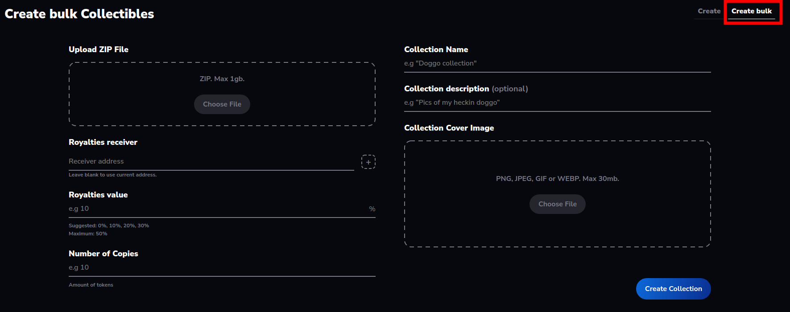

> :arrow_left: [back to menu](../README.md#sqwid-marketplace-user-guide)

# **Create Bulk Collectibles** (COMING SOON)

You can mint a batch of NFTs and assign them to a new collection.

The NFTs are created using the [SqwidERC1155 contract](https://reefscan.com/contract/0x0601202b75C96A61CDb9A99D4e2285E43c6e60e4), which follows the ERC-1155 standard and extends it with additional functionalities.

To create a batch of collectibles navigate to the **[Create page](https://sqwid.app/create)** and choose the **Create bulk** option in the submenu. There you will find the following form:

<p align="center">
  
</p>

-   **Upload ZIP file**: Upload ZIP with the media files for the different NFTs and a CSV file with the metadata of all the items. The files will be stored in IPFS and its URI referenced in your NFTs. More info in [ZIP file guidelines](#zip-file-guidelines) section.
-   **Royalties receiver**: Address of the royalties receiver. If no address is specified, the active address will be used. Clicking on the "+" button will open a popup to create a payment splitter contract though the [**Splitz** dAPP](https://splitz-dapp.web.app/).
-   **Royalties value**: Value of the royalties in percentage. Can range from 0 to 50. The default value is 0. You can read more about how royalties work [here](./royalties.md#royalties).
-   **Number of Copies**: How many copies of each NFT you want to mint. The default value is 1.
-   **Collection Name**: Name of the new collection.
-   **Description**: A description for your collection. Optional field.
-   **Collection Cover Image**: A file of up to 30Mb.

<br>

Once the ZIP file has been uploaded and the mandatory fields have been filled you just have to click on the **Create Collection** button and you will have to sign some transactions:

-   The first one is an approval for the SqwidMarketplace contract to mint new NFTs in the SqwidERC1155 contract. This only has to be done the first time you mint an NFT.
-   The next transactions will mint a batch of NFTs and register them into the marketplace. Note that by registering the NFTs in the marketplace you are not transferring their ownership, or any other rights over the NFTs.

After the NFTs have been created, you will be redirected to the collection detail page. The NFTs will appear once the content has passed the moderation process in order to avoid inappropriate content (like pornography or unauthorized use of intellectual property). This process can take several minutes, depending on the number of items and their size.

In your profile, you can find all your **[collections](https://sqwid.app/profile?tab=Collections)** and **[available NFTs](https://sqwid.app/profile?tab=Available)**.

## ZIP file guidelines
- The maximum size of the ZIP file is 1Gb.
- The ZIP file can only contian the media files and a CSV file. It cannot contain any directories.

Example of ZIP file contents:

```
collection.zip
      ├── metadata.csv
      ├── sqwid-001.png
      ├── sqwid-002.png
      └── sqwid-003.png
```

### Media files
- The allowed extensions are png, jpeg and jpg.
- All the media files must have the same extension. 
- The maximum number of media files is 10,000.
- The maximum size of a media file is 100Mb.

## Metadata file
- Has to be in CSV (comma-separated values) format and named _metadata.csv_.
- The metadata file has to follow this format:
  
  Column 1
  - Header: "_name_"
  - Value: Name of the item

  Column 2
  - Header: "_description_"
  - Value: Description of the item (can be empty)

  Column 3
  - Header: "_filename_"
  - Value: Name of the file, including the extension

  Property columns
   - From column number 4 onwards, there can be added up to 100 columns that will correspond with a property for the item
   - Header: Name of the property
   - Value: Value of the property
  

Example of metadata file structure:

| name | description | filename | mouth | bg | eyes | base | special |
|:-----:|:-----:|:-----:|:-----:|:-----:|:-----:|:-----:|:-----:|
|Sqwid #1| Cool sqwid number 1 | sqwid-001.png |1|dark|2|orange||
|Sqwid #2| Cool sqwid number 2 | sqwid-002.png |3|dark|1|brown|hat|
|Sqwid #3| Cool sqwid number 3 | sqwid-003.png |2|sky|4|purple|snorkle|


> Learn more about how to create **[sales](../market_interaction/regular_sale.md#regular-sale)**, **[auctions](../market_interaction/auction.md#auction)**, **[raffles](../market_interaction/raffle.md#raffle)** and **[loan proposals](../market_interaction/loan.md#loan)**.

> :arrow_left: [back to menu](../README.md#sqwid-marketplace-user-guide)
